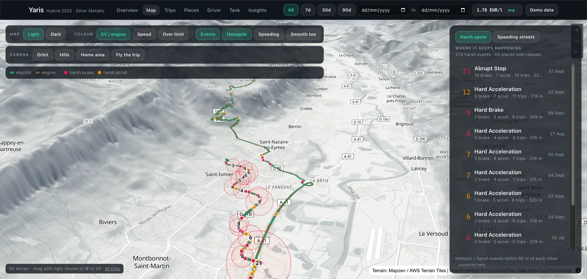
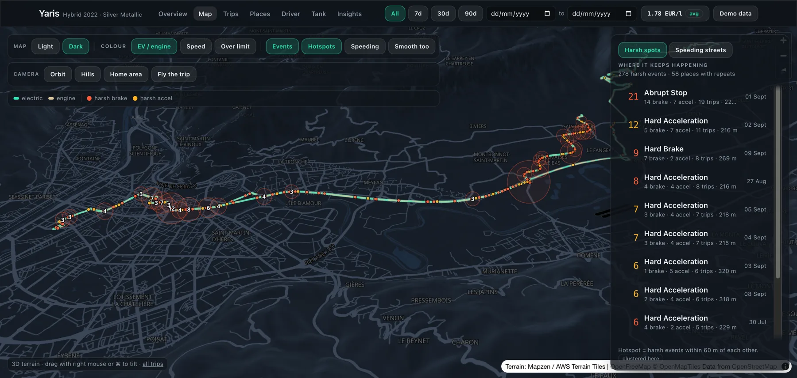
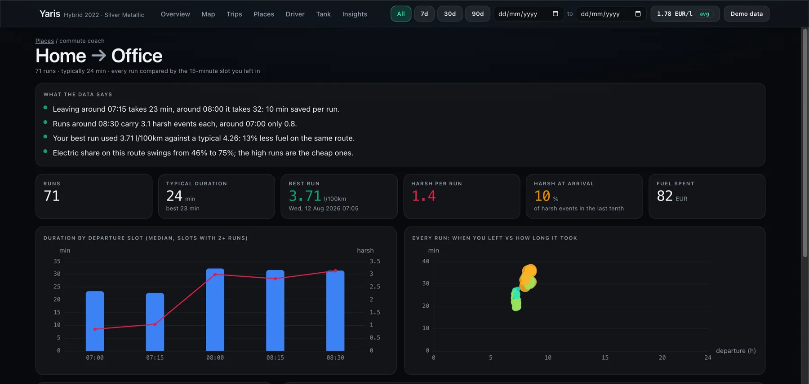
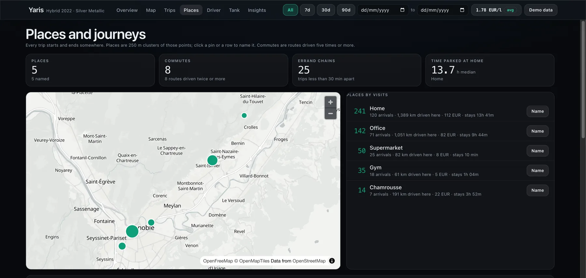
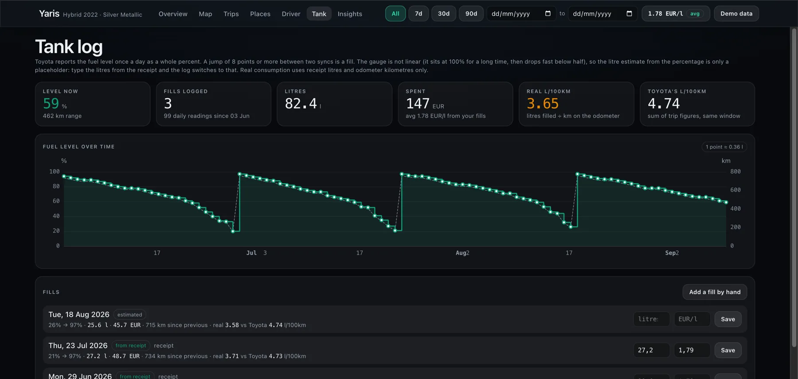
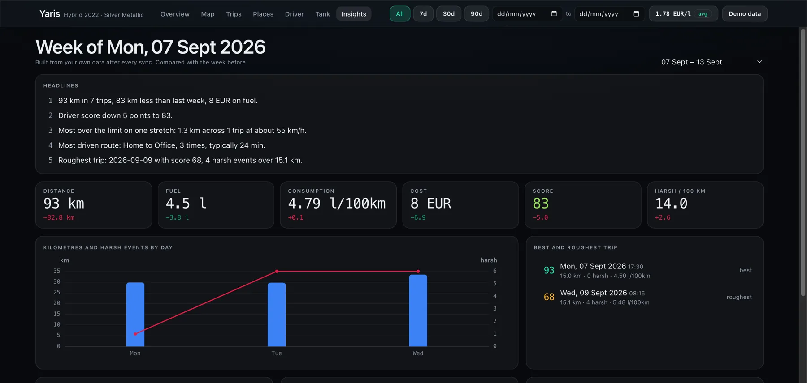
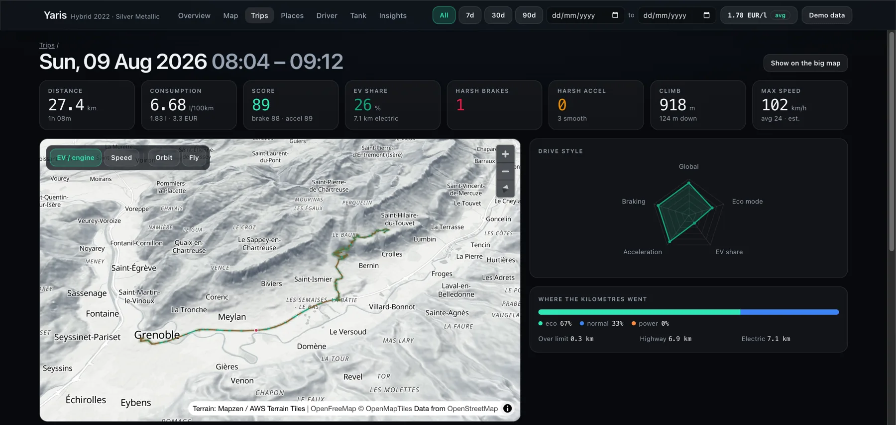

# toyota-telemetry

Your Toyota already records every trip you drive: the route, how much electric you used, and
every time it decided you braked or accelerated harder than you should have. The app shows
you one trip at a time and forgets the rest. This pulls the lot onto your own machine and
answers the question the app cannot: **where do you keep driving badly, and what does it cost?**

[](LICENSE)
[](pyproject.toml)
[](#maps-without-keys)
[](https://github.com/vidoluco/toyota-telemetry/actions/workflows/ci.yml)



No hardware, no dongle, no subscription. Toyota Connected Services collects this for the
MyToyota app; a local sync copies it into SQLite once a day and the dashboard runs on
`127.0.0.1`. Nothing leaves your machine.

## See it before you connect a car

```bash
git clone https://github.com/vidoluco/toyota-telemetry && cd toyota-telemetry
uv sync && (cd web && npm ci && npm run build)
uv run toyota demo          # synthetic driver, real roads, opens on http://127.0.0.1:8000
```

Every screenshot on this page is that demo: a fictional commuter near Grenoble, generated
from a seed. No real GPS trace ships in this repository.

## What it shows you

**Hotspots: the same corner, again and again.** The car flags harsh braking and acceleration
with coordinates. Cluster them across months and the map stops being a diary and starts being
a list of places you get wrong: this junction, nineteen trips, twenty-one events.



**The commute coach.** Any route driven five times or more gets compared with itself, run by
run, grouped by the quarter hour you left in.



> Leaving around 07:15 takes 23 min, around 08:00 it takes 32: 10 min saved per run.
> Runs around 08:30 carry 3.1 harsh events each, around 07:00 only 0.8.
> Your best run used 3.71 l/100km against a typical 4.26: 13% less fuel on the same route.

**Places, named by you.** Trip ends cluster into places; you name them once. After that
everything speaks in your words: how often, how long you stay, what each place costs in fuel,
which errand chains you run without going home in between.



**A tank log that admits what it does not know.** The car reports the fuel level once a day as
a whole percent, and that gauge is not linear. Fills are detected from the jump; the litres
stay an estimate until you type the receipt, and real consumption is computed from receipt
litres and odometer kilometres, never from the gauge.



**A weekly digest, computed locally.** No model, no cloud: the same numbers, compared with
last week and written as sentences.



**Per-trip detail** with the route on terrain, speed and elevation along the way, and every
coaching event pinned where it happened.



## What Toyota's own app does not do

| | MyToyota app | Here |
|---|---|---|
| Coaching events | one trip at a time | clustered across months, ranked by repetition |
| Routes | one trip at a time | all of them at once, on 3D terrain |
| Commutes | not a concept | detected, compared by departure slot, coached |
| Places | not a concept | clustered, named, costed |
| Speeding | not shown | over-limit stretches ranked by how often you repeat them |
| Fuel spend | not shown | per trip, per place, per route, from your own receipts |
| Your data | on Toyota's servers | in a SQLite file you own |

## Running it against your own car

| Step | Command |
|---|---|
| Install | `uv sync && (cd web && npm ci && npm run build)` |
| Credentials | `cp .env.example .env`, then fill in the MyToyota email and password |
| Look before you leap | `uv run python scripts/probe.py` prints what your car actually returns |
| First pull | `uv run toyota sync --full` |
| Daily refresh | `uv run toyota sync`, or `uv run toyota schedule install` for a launchd agent at 07:15 |
| Dashboard | `uv run toyota serve` then open http://127.0.0.1:8000 |
| Rebuild offline | `uv run toyota load` (from the cached raw responses, no network) |
| Tests | `uv run pytest` and `cd web && npx vitest run` |

Requires a Toyota with Connected Services active in Europe (the `ctpa-oneapi` backend) and
driving analytics enabled. The probe tells you in ten seconds whether yours qualifies.

## How it works

```
MyToyota account ──> pytoyoda auth ──> raw JSON cache (data/raw/)
                                            │
                                            ▼
                          SQLite: trips, route points, events,
                          places, fills, daily and monthly stats
                                            │
                          derived here: point timestamps, speed,
                          elevation, climb, hotspots, journeys
                                            │
                                            ▼
                    FastAPI (docs/api-contract.md) ──> React + MapLibre
```

Toyota sends route points without timestamps, so speed is derived: times are interpolated
between the trip start, each coaching event and the trip end, GPS spikes are removed, and the
result is used for shape, never for a headline number. **Toyota reports no speed except the
average per trip**: no top speed, no per-point speed, nothing. A reconstruction from points
with no timestamps turned out to depend on the filtering threshold rather than on the
driving, so no top-speed figure is published anywhere in this dashboard. The pace curve and
the pace colouring on the map say fast against slow, and the numbers you can quote are
Toyota's own: distance, duration, average speed, fuel. Elevation comes from public terrain
tiles. Nothing is invented silently.

## Maps without keys

The basemap is [OpenFreeMap](https://openfreemap.org) and the terrain is the
[AWS Terrain Tiles](https://registry.opendata.aws/terrain-tiles/) public dataset. No token, no
account, no usage dashboard.

## Privacy

`.env` and `data/` are git-ignored and stay on your machine. The cache holds precise GPS
traces of everywhere you have driven: treat that directory like a diary. The dashboard binds
to `127.0.0.1`. No telemetry, no analytics, no third-party calls beyond map tiles and Toyota
itself.

## Gotchas worth knowing

- **MapLibre 6 loads its worker from a separate module.** Vite does not emit it, so
  `web/src/map/terrain.ts` imports it with `?worker&url` and calls `setWorkerUrl`. Without
  that the map stays black and reports nothing: every worker request pends forever.
- **pytoyoda's typed vehicle model can reject a car** (a missing `remoteDisplay` field, for
  one), so `toyota_telemetry/toyota.py` reads raw JSON through the authenticated controller instead.
- **Toyota keeps trips only while connected services are active.** Whatever the API gives you
  on the first `--full` sync is your history: keep `data/raw/` backed up.
- **The coaching events describe you, not the car.** They are marks on how the pedal was
  pressed, so a harsh event never means the vehicle braked for you: automatic emergency
  braking and the pre-collision system are not reported through this API at all. The code
  labels in `toyota_telemetry/labels.py` are inferred, and a `severity` of `10000.0` is a
  sentinel meaning "not reported", not a huge number.
- **The endpoints are undocumented and unofficial.** They change. This is a hobby project, not
  a product, and it is not affiliated with or endorsed by Toyota.

## Licence

MIT. See [LICENSE](LICENSE).
